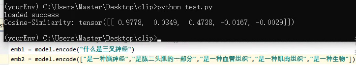
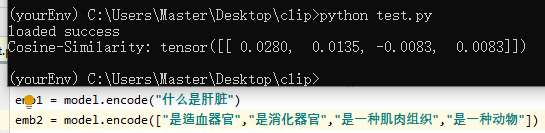
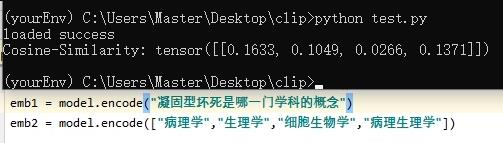
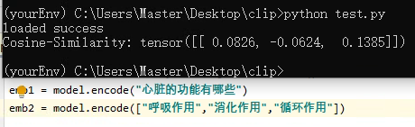
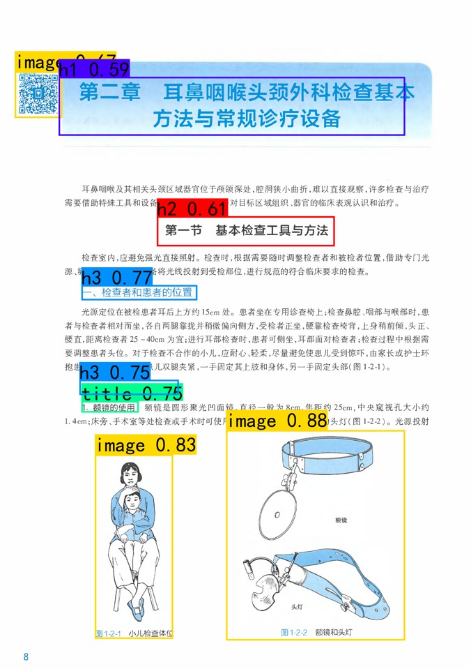
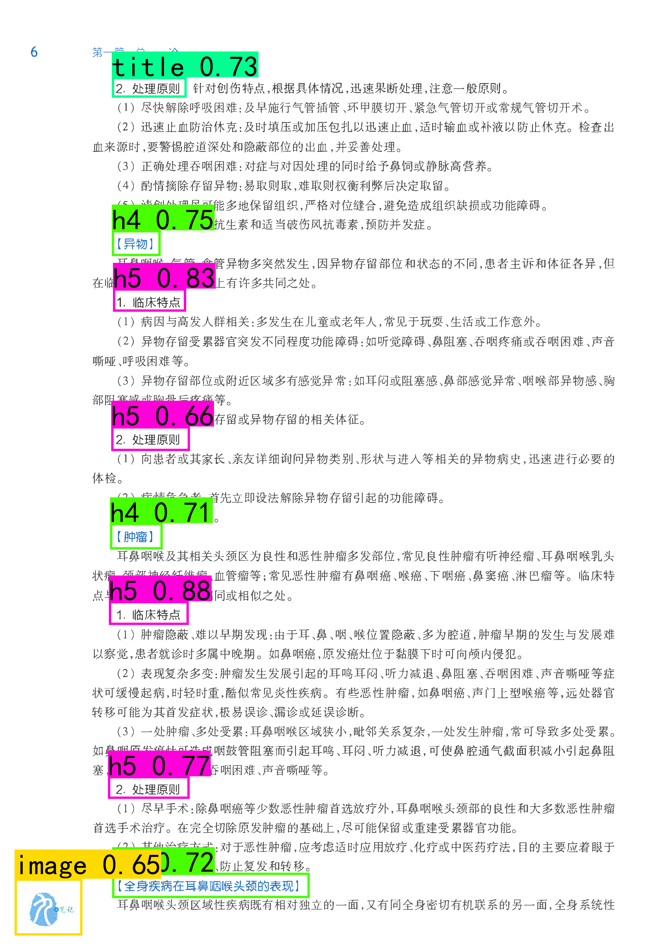
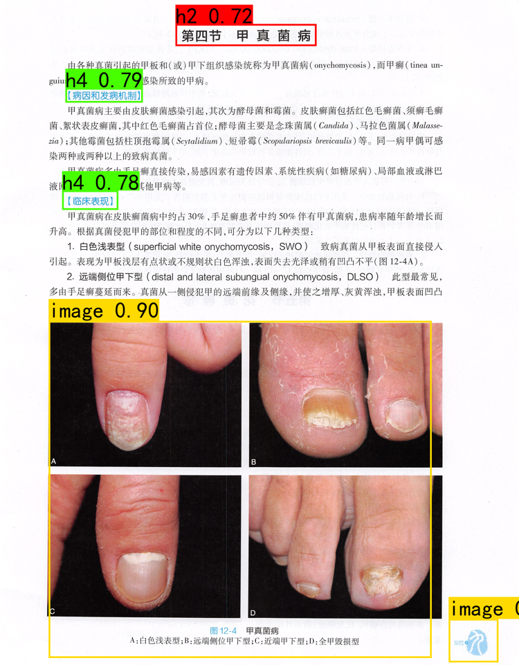
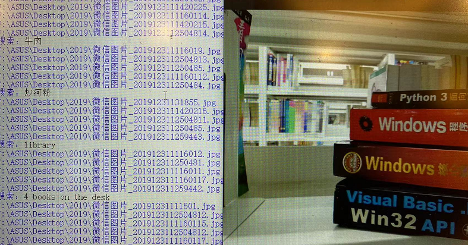

# OpenSource_Medical_Pro

*注意：禁止用于商业用途，欢迎个人学习交流！*

# 介绍（introduction）
* 个人的开源医学计划，旨在构建一个功能强大的本地AI工具箱，使得大家能够像使用搜索引擎搜索东西那样搜索自己的**本地知识库**，提高工作学习效率。
* 目前上线的医学教材搜索引擎支持多关键词文段搜索，搜索出
* 构建中文（多语言）NLP针对临床医学、口腔医学领域的知识库语料库，训练具有先验医学专业知识的本地多模态向量搜索引擎；
* 构建扫描版pdf电子教材自动转换器，实现全书语义检索，解决扫描版pdf电子教材检索、编辑困难的问题；
* 实现医学pdf电子教材思维导图生成器；做具有网页信息再筛选功能的浏览器插件，将具有先验知识的向量搜索引擎部署到本地浏览器！
* 该项目也会整合一些其他的医学AI项目完善各种实际需求！欢迎**共同建设**！
* 项目同时备份在[Notion](https://heathered-aster-9c5.notion.site/OpenSource_Medical_Pro-21c8867079f345f190db4da3cada7fe0)，国内访问速度慢图片无法打开等问题可以尝试切换一下

## 原理
使用大量医学文本对做对比学习，文本编码器通过计算对比句子与句子之间（QA问答等）、句子与文本之间做余弦相似度（Cosine Similarity）来获得学习效果

## 目录导航(Navigate)
- [介绍（introduction）](#介绍（introduction）)
- [原理](##原理)
- [目录导航](##目录导航(Navigate))
- [更新日志](##更新日志)
- [QuickStart](##QuickStart)
- [一些效果展示](##一些效果展示)
-   - [教材内容搜索引擎(支持多关键词文段定位搜索](###教材内容搜索引擎(支持多关键词文段定位搜索）)
    - [具有先验医学专业知识的文本编码器](###具有先验医学专业知识的文本编码器)
    - [文本图像编码器做图像检索、文本检索](###文本图像编码器做图像检索、文本检索)
    - [使用目标检测技术对教材作预处理操作](###使用目标检测技术对教材作预处理操作)
- [一些展望以及过去相关项目](##一些展望以及过去相关项目)
- [更多](##更多)
    - [实现对人卫及相关医学扫描版pdf电子教材的语义检索](pdf教材检索/README.md)
    - [爬取构建各类wiki、百科等医学专业知识库、语料库](爬虫/README.md)
    - [构建具有先验医学专业知识的多模态向量搜索引擎](vector_engine/README.md)
    - [多模态向量搜索引擎浏览器本地插件化的相关实现](local_proxy/README.md)
    - [基于多模态向量搜索引擎的OCR离线题目搜索](ocr_search/README.md)
    - [多模态Transformer预模型模型权重下载](dataset/README.md)
    - [三模态情感模型构建](Three_model/README.md)
    - [yolox血液细胞形态学检测]()
    - [Xception细胞识别]()

## 更新日志
**注意:由于个人算力等资源有限且不少电子书内含水印等；txt版本电子书难免会有不少错漏，后续会继续优化，敬请理解**

2023/01/07 上线医学教材搜索引擎！

2022/09/20 新书持续更新inggg！

2022/09/18 完成人卫诊断学、病理等多本口腔、临床教材的OCR转化工作，具体请见releases

2022/09/11 爬取医学百科wiki等数万个词条并将其用于text encoder的训练

2022/08/25 测试用于浏览器信息过滤筛选的本地代理插件

2022/07/31 建立相关倒排索引等检索框架

## QuickStart
### 快速构建自己的本地知识库搜索引擎

# 更新日志

# 一些效果展示

### 教材内容搜索引擎(支持多关键词文段定位搜索）
>
> 

### 具有先验医学专业知识的文本编码器
>
> 
>
> 
>
> 
>
> 

### 使用目标检测技术对教材作预处理操作
>
> 
>
> 
>
> 

### 文本图像编码器做图像检索、文本检索

> 

# 一些展望以及相关资料
[中文医学词向量](https://github.com/WENGSYX/Chinese-Word2vec-Medicine)

[中文NLP医学领域分词器](https://github.com/lancopku/pkuseg-python)

[清华大学THUOCL NLP中文医学组词库](https://github.com/thunlp/THUOCL)

# 更多
1.对于教材搜索引擎，后续会不断增多教材可搜索类目并且引入Bert对搜索结果进行过滤；且允许用户上传自己的pdf电子书进行转化搜索！

2.后续进展会不定时更新，欢迎大家贡献各种 **.docx** / **.txt** 版本的医学电子教材

3.项目同时备份，更多相关项目欢迎留意个人Notion主站、bilibili 等社交平台

4.欢迎[捐赠](https://heathered-aster-9c5.notion.site/Donation-776182b0909f4416be1583e31477bf8e)给予小编更多支持与鼓励（未完待续）！
